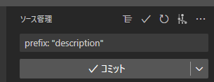
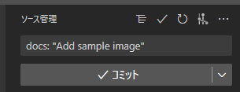
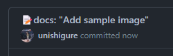

# Custom commit message template

For readable commit messages✨


## Setup

Copy `.gitmessage` and `.githooks` to Your Project.

Set commit message template

```ps1
git config commit.template .gitmessage
```

Set githooks path

```ps1
git config --local core.hooksPath .githooks
```

## Usage

Prepared template



Replace commit message



Commit!



## Ref

- [Conventional Commits](https://www.conventionalcommits.org/ja/v1.0.0/)
- [見やすく意味のあるコミットメッセージを効率的に書く方法](https://zenn.dev/y16ra/articles/23c06e672091af)
- [commit.templateのすすめ #Git - Qiita](https://qiita.com/hhujk5/items/09d2d8aa299528f03ed2)
- [git - pre-commit/hook: No such file or directory - Stack Overflow](https://stackoverflow.com/a/63386102)
- [sed コマンド【使い方 まとめ】 - RAKUS Developers Blog | ラクス エンジニアブログ](https://tech-blog.rakus.co.jp/entry/20211022/sed)
